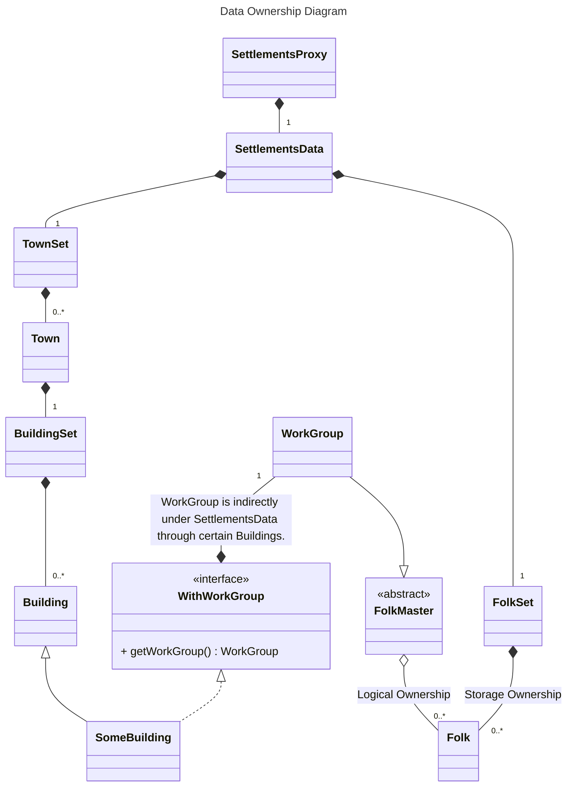
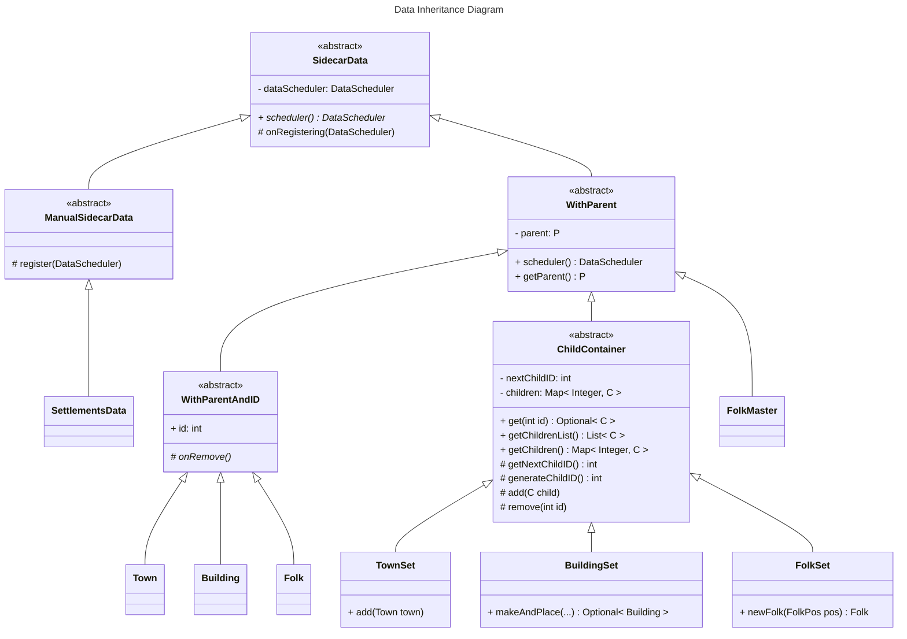

# engine/data Explanation

## Background
Within the module logic thread, there are relationships between entities that form a tree structure, with *SettlementsData* as the root. *SettlementsProxy* manages the *SettlementsData*.

1. Each entity needs access to the entity it belongs to.
2. Each entity must be saved and read via `com.mojang.serialization.Codec`. The assembly of ownership relationships must be mounted after the entity is fully constructed.
3. After *SettlementsData* is mounted to *SettlementsProxy*, its descendant entities have tasks to register with *DataScheduler* (which belongs to *SettlementsProxy*).

Due to these requirements, the library provides a series of tool abstract classes based on *SidecarData*. Entities in the logic thread only need to extend these tool classes to manage the entire process.

All one-to-one containment relationships are established by adding the `@Child` annotation to attribute fields.
- This attribute must be `final`. The child object must be constructed when the parent object is completed.
- This attribute must extend *WithParent*.
- The reference to the parent node in this attribute will be set after the parent object is registered. Then the tasks of this attribute are registered.

All one-to-many containment relationships are accomplished by inheriting *ChildContainer*.
- All child objects can be added dynamically via the `add` method. Note that this method is `protected`, so how child objects are added should be logically encapsulated specifically.
- Child objects must extend *WithParentAndID*.
- Registration tasks for child objects will be completed after setting the parent node reference:
    - After initialization and before parent object registration, the reference of the child object will be set after the parent is registered.
    - After the parent is registered, the reference of the child will be immediately set after the `add` method is called.

