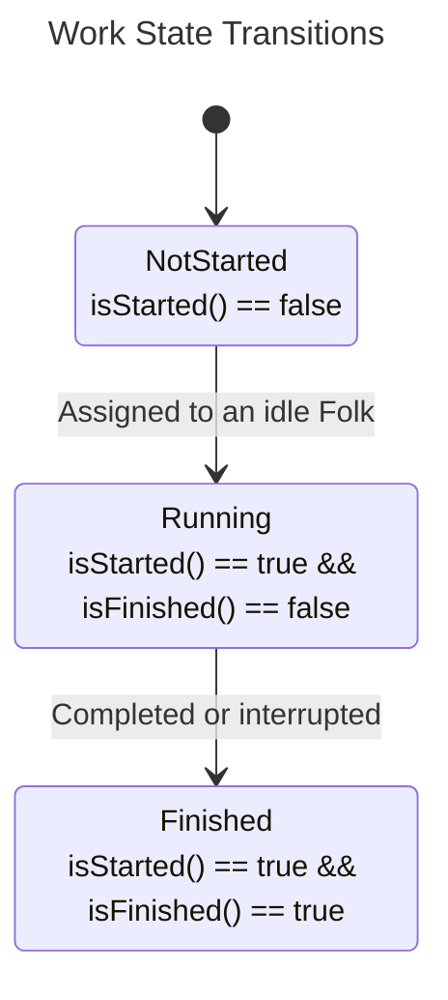
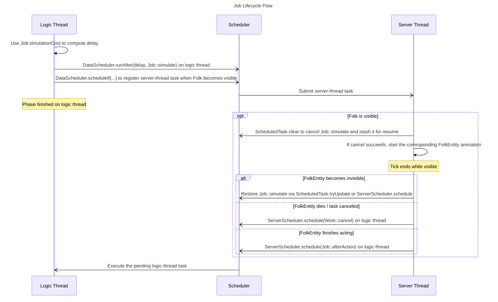

# Folk ↔ FolkEntity Interaction Design

## 1. Class / Interface Overview

### Folk, FolkSet, FolkMaster
These classes live in `com.outlook.hxsw.settlements.engine.folks`.

- `Folk` is the logic-thread object owned by `SettlementsData`. It carries all real scheduling and simulation on the logic thread. Each `Folk` has a unique ID within a `SettlementsData` instance and is stored in a `FolkSet`.
- `FolkMaster` represents the logical owner/manager of a `Folk`. All actions performed by a `Folk` on the logic thread are orchestrated by its `FolkMaster`.

### WorkGroup, Job, Jobs, Work
These classes are in `com.outlook.hxsw.settlements.engine.folks.job`.

- `WorkGroup` is a concrete `FolkMaster` implementation. It dispatches `Job` chains (aka `Jobs`) to the `Folk` it manages, turning them into `Work`.
- `Job` is the atomic unit of work a `Folk` can execute. Multiple `Job` instances can be chained into `Jobs`.

```java
public abstract class Job<I, A, O> { /* ... */ }
```

Each `Job` has an input type `I` and an output type `O`.

Executing a `Job` consumes an `I` instance and produces an `O` result. Therefore, inside `Jobs`, every `Job`’s `O` must match the next `Job`’s `I`. Running a `Jobs` chain only needs the `I` of the first `Job`; each `O` is passed to the next `Job` as its `I`.

Use the `then` methods on `Job` or `Jobs` to build chains. Once a `Job` or `Jobs` is passed into `WorkGroup.addWork`, it becomes a `Work`.

When a `Job` starts and the entity representing its `Folk` is visible, `generateAction` will be called to create a `FolkAction` and dispatch it to the `FolkEntity` to perform. The performance result type of this `FolkAction` is the generic type `A`.



### FolkEntity, FolkAction, FolkEntityReference
These classes are in `com.outlook.hxsw.settlements.entities.folk`.

- `FolkEntity` is the in-world representation of a `Folk`, giving players something visible/interactable. To avoid cross-thread data races, the entity never drives core logic itself; it only manipulates shared state via thread-safe structures. Conceptually, `FolkEntity` is just the “actor on stage,” and it is not even saved inside chunks.
- `FolkAction` describes the current performance/animation executed by a `FolkEntity`. It is dispatched entirely by logic-layer `Job`s. With the current logic, if a `Work` is canceled on the logic side, the `FolkAction` it dispatched will not be canceled; instead, it will only be overwritten by newly dispatched `FolkAction`s.
- `FolkEntityReference` is a handle stored inside `FolkShareZone`. It provides the static helper:

```java
public static Optional<FolkEntity> getOrGenerate(MinecraftServer server, FolkShareZone zone) { /* ... */ }
```

which fetches or spawns the unique `FolkEntity` tied to a `FolkShareZone`.

### FolkPos
`FolkPos` and all its subclasses live in `com.outlook.hxsw.settlements.engine.folks.pos`.

- `FolkPos` represents the logical position of a `Folk`. This value is stored in `FolkShareZone`.
- `FolkPos` is immutable. The position information it carries can be accessed from any thread.
- It can also be converted into a real in-world position given a `Level`.

## 2. Job Lifecycle Flow


## 3. FolkEntity Spawn Logic
1. FolkEntities are spawned only by their `FolkMaster` and disappear when the chunk unloads.
2. Calling `FolkEntityReference.getOrGenerate` fetches or spawns the unique `FolkEntity` tied to that zone. Every “load” mentioned below refers to this method.
3. For `WorkGroup` FolkMasters:
   1. Idle Folk would load near an entity bound to the `WorkGroup` (typically a building center block entity).
      > Currently no building center block exists, so idle Folk cannot be driven to load this way.
   2. When a Folk receives a new `Job`, it loads right before that `Job` starts.