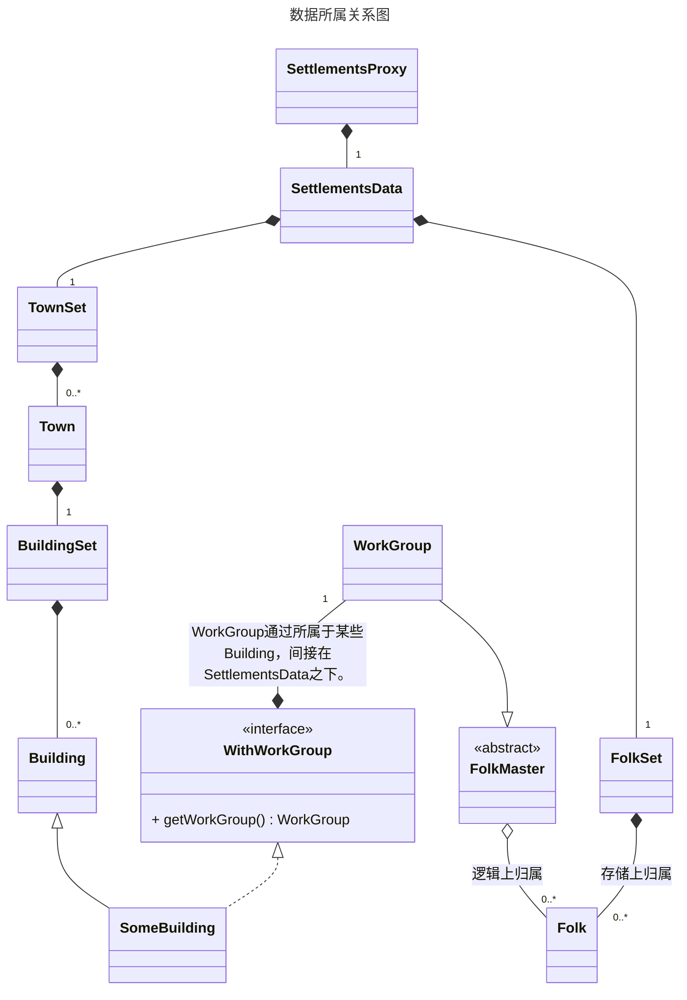
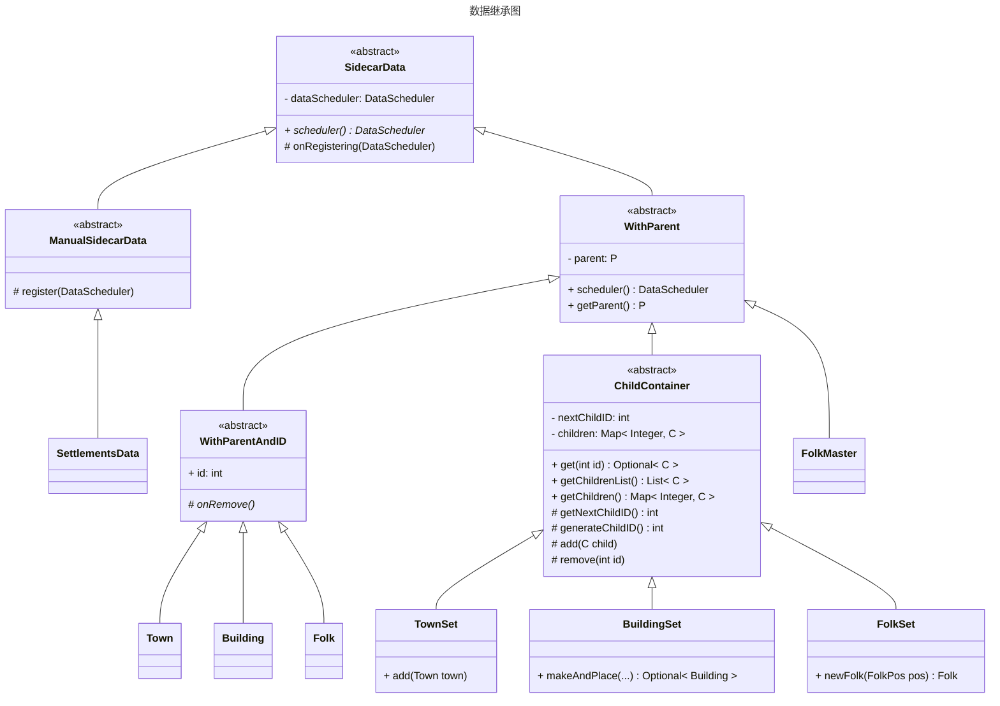

# engine/data 说明

## 背景
模组逻辑线程中的实体间有着蕴含关系，这些关系组成了一颗以*SettlementsData*为根的树。
*SettlementsProxy*调度着*SettlementsData*。

1. 每一个实体都有访问其所属的实体的需求。
2. 每个实体都要通过`com.mojang.serialization.Codec`保存和读取。所属关系的组装不得不在实体构造完后挂载。
3. 在*SettlementsData*被挂载到*SettlementsProxy*后，其子孙实体有任务要注册到*DataScheduler*（属于*SettlementsProxy*）中。

因为这些需求，库设立了以*SidecarData*为基础的一系列工具抽象类。逻辑线程实体只需要继承这些工具类即可完成管理的整个过程。

所有一对一包含关系通过在属性字段加`@Child`注解完成。
- 此属性必须是`final`的。在对象构造完成时，这个子对象也必须构造完成。
- 此属性必须继承*WithParent*。
- 此属性的母节点引用将在母对象注册后设置。此属性的任务随后注册。

所有一对多包含关系通过继承*ChildContainer*完成。
- 所有的子对象都可通过`add`方法动态添加。要注意，这个方法是`protected`的，如何添加子对象，应具体地封装逻辑。
- 子对象必须继承*WithParentAndID*。
- 子对象的注册任务都将在母节点引用设置后注册：
  - 初始化后且母对象注册前，子对象的母节点引用将在母对象注册后设置。
  - 母对象注册后，子对象的母节点引用会在调用完`add`方法后立刻设置。

