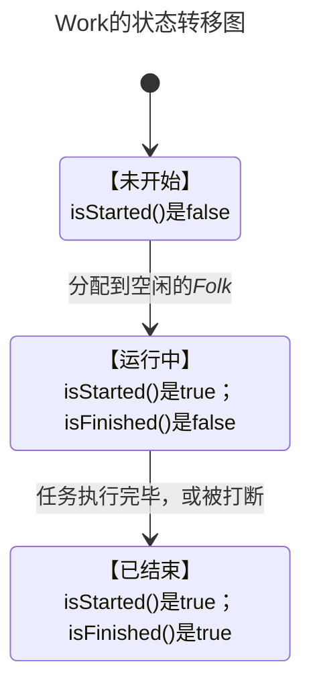
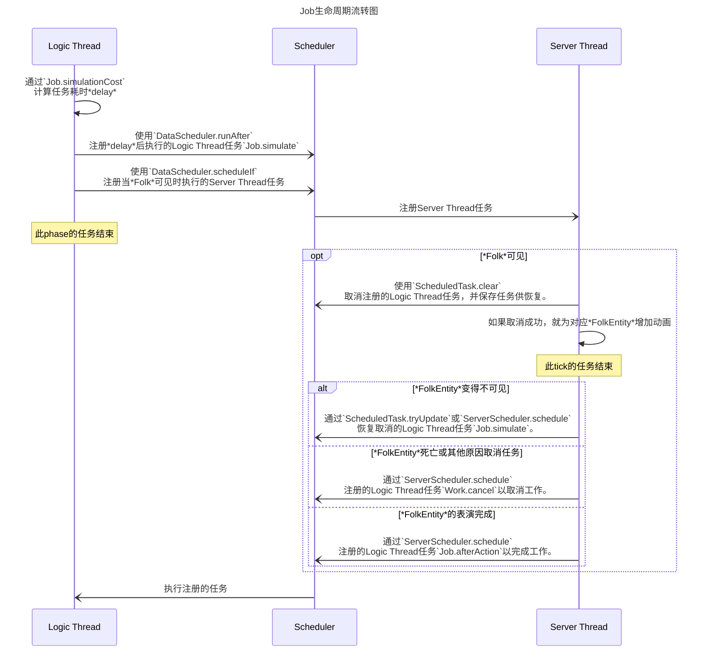

# Folk ↔ FolkEntity Interaction Design

## 类/接口解释

### *Folk*、*FolkSet*、*FolkMaster*是什么
这些类都在包`com.outlook.hxsw.settlements.engine.folks`中。

*Folk*是此mod逻辑线程的对象，属于*SettlementsData*。
*Folk*在逻辑线程中承载着mod实际的调度和演算。
*Folk*是一个全局的数据，包含在*FolkSet*中。每个*Folk*在一个*SettlementsData*中都有一个唯一的ID。

*FolkMaster*是一个*Folk*逻辑上的归属。所有*Folk*在逻辑线程的动作都由*Folk*的*FolkMaster*主导和管理。

### *WorkGroup*、*Job*、*Jobs*、*Work*是什么
这些类都在包`com.outlook.hxsw.settlements.engine.folks.job`中。

*WorkGroup*是一种*FolkMaster*的实现。*WorkGroup*负责给其管理的*Folk*派发*Jobs*，形成*Work*。

*Job*是*Folk*可执行的原子任务。一个或多个*Job*可形成*Folk*可执行的任务链*Jobs*。
```java
public abstract class Job<I, A, O> /*...*/ { /* ... */ }
```
每个*Job*都有一个输入类型参数和输出类型参数。*Job*的执行需要传入一个`I`类型的参数，执行后会产出一个类型`O`的值。
因此，*Jobs*在结构上要求每个元素*Job*的`O`类型与下一个元素*Job*的`I`类型相同。
*Jobs*执行只需要传入其第一个元素*Job*的`I`类型实例（也是*Jobs*的范型`I`），每一个`Job`的执行结果`O`都会作为下一个`Job`的参数`I`传入。

将*Job*组装成*Jobs*应该使用*Job*或*Jobs*的方法`then`进行。

当一个*Job*或*Jobs*传入*WorkGroup*的方法`addWork`中时，就变成了*Work*。

当*Job*开始且其工作的*Folk*所表现的实体可见，会用方法`generateAction`生成一个*FolkAction*，并将其派发给*FolkEntity*表演。
此*FolkAction*的表演结果的类型是范型类型`A`。



### *FolkEntity*、*FolkAction*、*FolkEntityReference*是什么
这些类都在包`com.outlook.hxsw.settlements.entities.folk`中。

*FolkEntity*是*Folk*在游戏世界中存在的实体，作为玩家感知*Folk*存在的最直观方式。
由于线程间防止数据竞争，实体不会直接参与mod逻辑的调度和演算，只会通过线程安全的方式修改*Folk*或其它相关变量。
我们就仅仅是希望*FolkEntity*是这个舞台的演员而已。这个实体甚至不会保存在区块中。

*FolkAction*是*FolkEntity*目前表演的工作。它完全由逻辑层的*Job*派发。
按目前的逻辑，如果*Work*在逻辑上取消了，那么他派发的*FolkAction*不会取消，而只是会被新派发的*FolkAction*覆盖。

*FolkEntityReference*是*FolkEntity*的引用，存储于*FolkShareZone*中。
*FolkEntityReference*有方法：
```java
public static Optional<FolkEntity> getOrGenerate(MinecraftServer server, FolkShareZone zone) { /*...*/ }
```
用于获取或生成*FolkShareZone*对应的*FolkEntity*。

### *FolkPos*是什么
*FolkPos*和它所有子类都在包`com.outlook.hxsw.settlements.engine.folks.pos`中。

*FolkPos*表示*Folk*所在的逻辑位置。这个值保存在*FolkShareZone*中。
*FolkPos*是一个不可变对象。他所表示的位置信息，在任何线程都可以访问。他还可通过传入*Level*获取在实际世界的位置。

## *Job*生命周期流转图


## *FolkEntity*生成逻辑
1. 只由其*FolkMaster*生成。在区块卸载时消失。
2. 调用*FolkEntityReference*中的静态方法`getOrGenerate`会获取或生成唯一的*FolkEntity*。 
   下文的**加载**都指通过这个方法生成（或获取——如果已经存在这个对应的实体）这个实体。
3. 对于*WorkGroup*类型的*FolkMaster*：
   1. 空闲的*Folk*将会在*WorkGroup*绑定的一个实体（通常是建筑中心方块的BlockEntity）加载时**加载**在旁边。
      - > 目前没有建筑中心方块，所以这一项无法实现。闲着的Folk不会有什么行为控制加载。
   2. 被派发任务的*Folk*将会在每个*Job*开始的时候**加载**。
