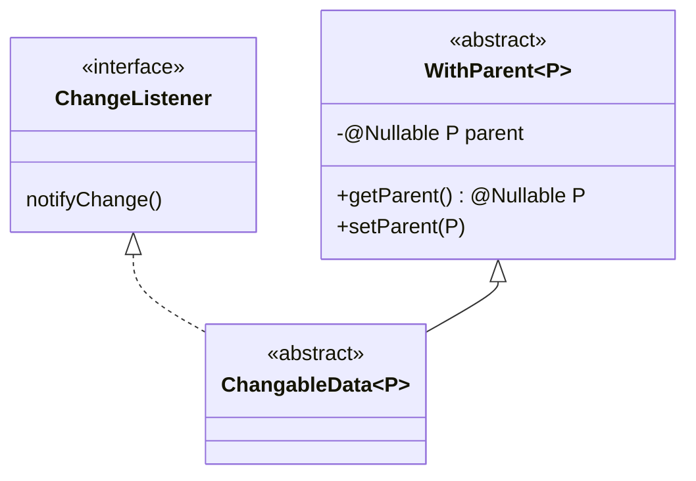
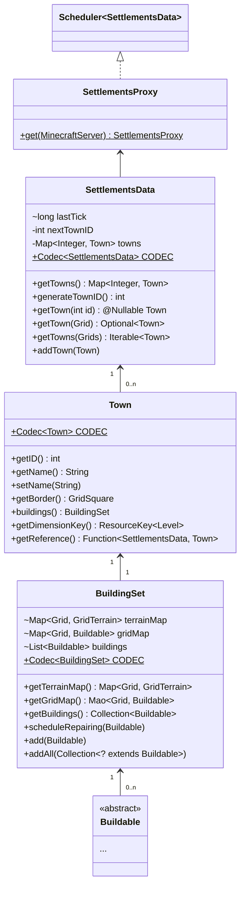
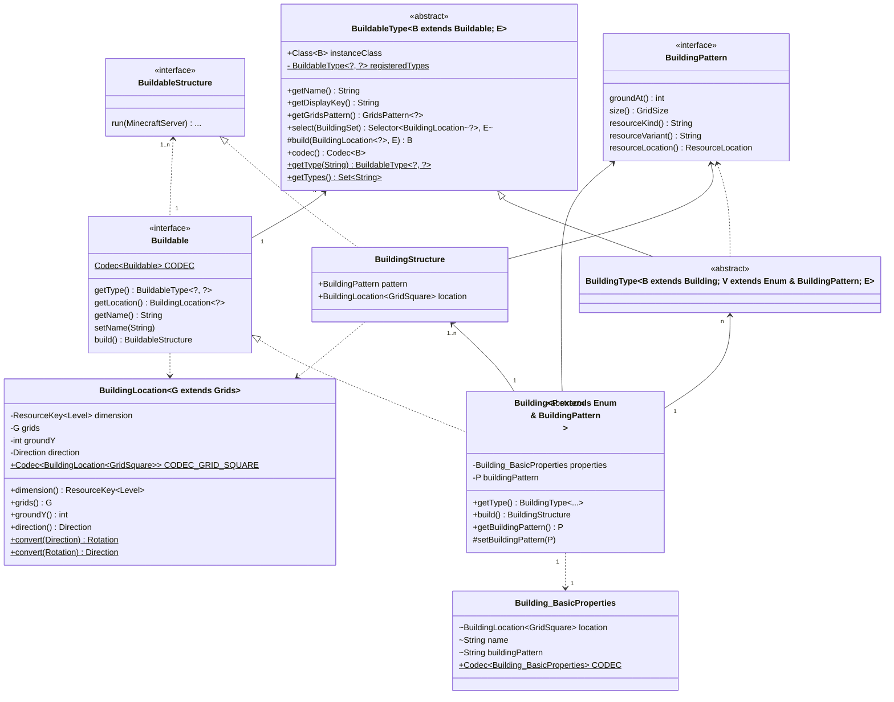

# Settlements Engine 设计总览

本模块为定居点构筑玩法提供核心抽象与分层，结构如图、说明如下。

---

## 1. 数据变更与父子关系

模块采用监听器与父指针实现链式数据管理。
- `ChangeListener` 定义变更监听接口。
- `ChangableData` 为所有数据对象统一的变更通知基类。
- `WithParent` 提供父级引用体系，实现多级数据层次。

结构图如下：

## 2. 定居点主干（核心数据、代理）

`SettlementsData` 统一维护所有城镇（`Town`）、建筑集合（`BuildingSet`），并通过 `SettlementsProxy` 协调世界内状态。

结构图如下：

## 3. 建筑物与构造系统

全部建筑数据、行为及其实例抽象为 `Buildable` 及相关分层，实现类型注册、属性配置、世界定位与实例化。

- Buildable 和 BuildableStructure 为一切可建设物及其实例定义标准接口，实现类型、位置、创建流程与可序列化交互。
- Building、BuildingPattern、BuildingType、Building_BasicProperties 协同，将建筑类型、实例属性、结构和外观等切面进行细分，允许灵活扩展与多样性组合。
- BuildingLocation 精确表达建筑物在世界中的维度、坐标、方向等。
- BuildableType 及其子类，提供“注册型建筑种类”的管理、查找和工厂函数。
- 各抽象充分使用 Java 泛型，增强模块化与类型安全。
